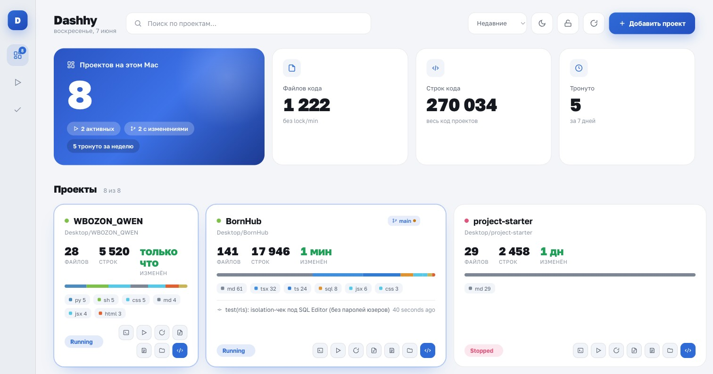
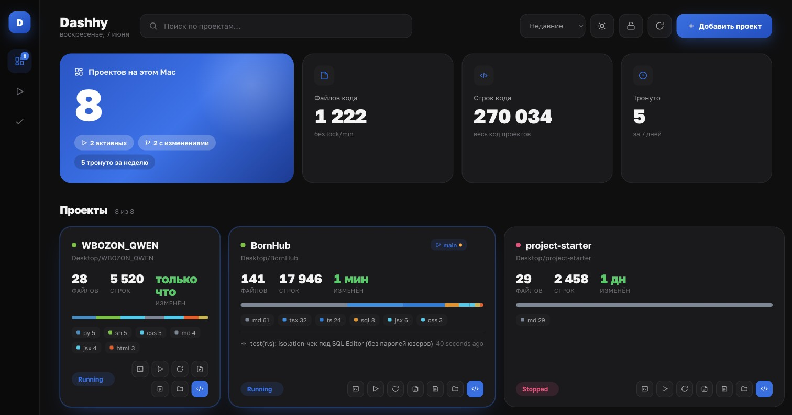

<div align="center">

# Dashhy

**A local dashboard for all the project folders on your Mac.**
Зайди один раз — и увидь все свои проекты сразу: код, языки, git-статус, заметки.



[Features](#-features) · [Quick start](#-quick-start) · [Install guide](INSTALL.md) · [Security](#-security--privacy) · [Возможности](#-возможности-ru) · [Установка](INSTALL.md)

</div>

---

Dashhy scans the folders you point it at, then shows each one as a card with
real numbers — files of code, lines, language breakdown, git branch & status,
last activity — plus one-click buttons to open the folder in your editor, a
Terminal, or Finder. It runs **entirely on your machine**: a tiny Python
backend (standard library only) serves a web UI inside a native macOS window.
No accounts, no cloud, no telemetry.

> 🇷🇺 Русское описание — [ниже](#-возможности-ru). Установка для всех — [INSTALL.md](INSTALL.md).

---

## ✨ Features

### See everything at a glance
- **Project cards** — status dot, name, short path, **files of code · lines · last-modified**, a stacked **language bar** + per-language chips.
- **Top stats** — total projects, how many are *running*, how many have *uncommitted git changes*, how many you *touched this week*, plus total code files & lines across everything.
- **Git snapshot** (local-only, offline) — current branch, dirty/clean, ahead/behind, and the last commit subject with a relative date. Uses only local refs, never the network.
- **Health hint** — a project touched <7 days ago is green, 7–30 days amber, older is muted.
- **Hover popover** — auto-detected project *kind* (Node.js · Next.js, Python, Rust, Go, …), a one-line description pulled from the manifest or README, stats, and top languages.

### Add & discover projects
- **Add a folder** — native macOS folder picker → the project is scanned automatically.
- **Discover** — point at a parent folder and Dashhy auto-adds every repo-like subfolder it finds (anything containing `.git`, `package.json`, `pyproject.toml`, `requirements.txt`, `Cargo.toml`, `go.mod`, or `composer.json`).
- **Scan** counts code files & lines and breaks them down by language. Lock files (`package-lock.json`, `yarn.lock`, …), `node_modules`, `dist`, `build`, `.git`, minified files and other noise are skipped, so the numbers reflect *your* code.

### Do something with a project (one click per card)
| Button | What it does |
|--------|--------------|
| **Open in editor** | VS Code → Cursor → falls back to Finder |
| **Open Terminal here** | new Terminal already `cd`-ed into the folder |
| **Run** | save a run command (e.g. `npm run dev`) and launch it in Terminal; Alt-click to edit |
| **Rescan** | refresh files/lines/git for that one project |
| **Files** | a modal with a file tree + a built-in viewer for any code/text file |
| **Notes / TODO** | a per-project scratchpad ("where I left off", bugs, ideas) |
| **Open in Finder** | reveal the folder |
| **Status** | mark a project Idle / Analyzing / Running / Stopped / Complete |

### Get around fast
- **⌘K command palette** — fuzzy-search every action and every project ("open X in editor", "Terminal: X", scan all, switch theme…).
- **Search** by name or path, **sort** by recent / name / size, **filter** by status in the sidebar.
- **Light & dark** themes (remembered between sessions).
- **Auto-refresh** when the window regains focus, so the dashboard always reflects reality (the heavier rescan is throttled).

### Native, but light
- Opens in a **real macOS window** (WKWebView via pywebview) — no browser chrome, no tabs, no address bar. Window size & position are remembered.
- A **browser fallback** (`python3 server.py`) needs *zero* dependencies — pure Python standard library.

---

## 🚀 Quick start

The zero-install way (opens in your browser, no `pip` needed):

```bash
git clone https://github.com/<your-username>/dashhy.git
cd dashhy/project-dashboard
python3 server.py          # → opens http://127.0.0.1:7777/
```

For the **native window** and a clickable app icon, see the full
**[INSTALL.md](INSTALL.md)** — it walks you through the one-line installer,
the native window, and (optionally) building a self-contained `Dashhy.app`.

> **macOS note:** to scan folders in `~/Desktop`, `~/Documents` or `~/Downloads`
> you may need to grant **Full Disk Access** once. Dashhy shows a banner and a
> button when it hits a folder it can't read. Details in [INSTALL.md](INSTALL.md).

---

## 🗂 Project structure

```
dashhy/
├─ README.md              ← you are here
├─ INSTALL.md             ← step-by-step install for everyone
├─ install.sh            ← one-command installer / launcher
├─ LICENSE                ← MIT
├─ SECURITY.md            ← security model + how to report issues
├─ THIRD_PARTY_NOTICES.md ← font attribution (Golos Text, OFL)
├─ docs/                  ← screenshots used by this README
└─ project-dashboard/
   ├─ app.py              ← default entry point — native macOS window
   ├─ server.py           ← HTTP server + JSON API + browser fallback
   ├─ build_app.sh        ← build a self-contained Dashhy.app (PyInstaller)
   ├─ requirements.txt    ← pywebview (only for the native window)
   └─ web/                ← the dashboard UI (HTML / CSS / JS, vanilla)
```

| File | Role |
|------|------|
| `project-dashboard/app.py` | **Default entry** — native window (pywebview / WKWebView), remembers geometry |
| `project-dashboard/server.py` | Backend: local HTTP server + JSON API (list / add / scan / open / read). Also the standalone browser mode |
| `web/index.html` | Dashboard shell (sidebar / topbar / bento grid) |
| `web/mi.css` | Design tokens + components (light + dark) |
| `web/golos.css` + `web/fonts/` | Bundled Golos Text webfont |
| `web/app.js` | Frontend logic (render, actions, theme, search, ⌘K) |

---

## 🔐 Security & privacy

Dashhy is built to stay on your machine:

- **Loopback only.** The server binds `127.0.0.1` (ports `7777`–`7796`). It is not reachable from your network.
- **Anti-CSRF / anti-DNS-rebinding.** Every request's `Host` and `Origin` are checked against loopback, so a random web page in your browser can't drive the API.
- **Filesystem guards.** Folders you add must live under your home directory; known credential directories (`~/.ssh`, `~/.aws`, `~/.gnupg`, `~/Library/Keychains`, …) are refused, path-traversal is blocked, and the file viewer only ever serves recognised **code/text** files — never raw secrets.
- **No network, no telemetry.** The backend is the Python standard library only. The single external command it runs is your local `git` (read-only, offline) for branch/status.
- **Private registry.** Your project list lives in `~/Library/Application Support/Dashhy/projects.json`, written atomically and `chmod 600`.

Full details and the audit summary are in **[SECURITY.md](SECURITY.md)**.

---

## 🛠 Requirements

- **macOS** (the native window, folder picker, Terminal/Finder/editor integration and Full-Disk-Access flow are macOS-specific).
- **Python 3** (ships with macOS as `/usr/bin/python3`).
- **pywebview** — only for the native window. The browser mode needs nothing.

---
---

<a name="-возможности-ru"></a>
## 🇷🇺 Dashhy — на русском

**Локальный дашборд всех твоих проектов на Mac.** Открой одно окно — и видишь
каждую папку проекта сразу: файлы кода, строки, языки, git-статус, заметки, и
кнопки «открыть в редакторе / Terminal / Finder». Работает **полностью на твоём
компьютере**: крошечный бэкенд на Python (только стандартная библиотека) отдаёт
веб-интерфейс в нативном окне macOS. Без аккаунтов, облака и телеметрии.



### Возможности

**Видеть всё сразу**
- **Карточки проектов** — статус, имя, короткий путь, **файлы · строки · когда менялся**, полоса языков и чипы по языкам.
- **Общая статистика** — всего проектов, сколько *запущено*, у скольких есть *несохранённые изменения* в git, сколько *тронуто за неделю*, плюс суммарно файлов и строк кода.
- **Git-снимок** (локально, без сети) — ветка, грязный/чистый, опережение/отставание, последний коммит и когда он был.
- **Индикатор активности** — тронут <7 дней назад → зелёный, 7–30 → жёлтый, давно → приглушённый.
- **Поповер при наведении** — тип проекта (Node.js · Next.js, Python, Rust, Go…), краткое описание из манифеста или README, статистика, языки.

**Добавлять и находить проекты**
- **Добавить папку** — нативный системный диалог выбора → авто-скан.
- **Найти в папке** — укажи родительскую папку, и Dashhy сам добавит все вложенные репозитории (где есть `.git`, `package.json`, `pyproject.toml`, `requirements.txt`, `Cargo.toml`, `go.mod`, `composer.json`).
- **Scan** считает файлы и строки кода с разбивкой по языкам. Lock-файлы, `node_modules`, `dist`, `build`, `.git` и минифицированные файлы пропускаются — цифры отражают *твой* код.

**Действия по проекту (одна кнопка на карточке)**

| Кнопка | Что делает |
|--------|------------|
| **Открыть в редакторе** | VS Code → Cursor → иначе Finder |
| **Открыть Terminal здесь** | новый Terminal уже в папке проекта |
| **Запустить** | сохрани команду (`npm run dev`) и запусти её в Terminal; Alt-клик — изменить |
| **Пересканировать** | обновить файлы/строки/git для проекта |
| **Файлы** | модалка: дерево файлов + просмотр содержимого |
| **Заметки / TODO** | блокнот по проекту (на чём остановился, баги, идеи) |
| **Открыть в Finder** | показать папку |
| **Статус** | Idle / Analyzing / Running / Stopped / Complete |

**Быстрая навигация**
- **⌘K — палитра команд** (нечёткий поиск): открыть проект в редакторе, Terminal по проекту, сканировать всё, сменить тему.
- **Поиск** по имени/пути, **сортировка** (недавние / имя / размер), **фильтры** по статусу в сайдбаре.
- **Светлая и тёмная** темы (запоминаются).
- **Авто-обновление** при возврате фокуса в окно (тяжёлый рескан троттлится).

**Нативно, но легко**
- Открывается в **настоящем окне macOS** (WKWebView через pywebview) — без вкладок и адресной строки; размер и позиция запоминаются.
- **Запасной режим в браузере** (`python3 server.py`) не требует *вообще никаких* зависимостей.

### Быстрый старт (без установки, в браузере)

```bash
git clone https://github.com/<твой-логин>/dashhy.git
cd dashhy/project-dashboard
python3 server.py          # → откроется http://127.0.0.1:7777/
```

Полная пошаговая установка (нативное окно, иконка приложения, сборка
`Dashhy.app`) — в **[INSTALL.md](INSTALL.md)**.

> **macOS:** чтобы сканировать `~/Desktop`, `~/Documents`, `~/Downloads`, может
> понадобиться один раз выдать **Full Disk Access**. Dashhy сам покажет баннер и
> кнопку, когда упрётся в папку без доступа. Подробности — в [INSTALL.md](INSTALL.md).

### Безопасность и приватность
- **Только loopback** — сервер слушает `127.0.0.1`, из сети недоступен.
- **Защита от CSRF / DNS-rebinding** — проверка `Host` и `Origin`.
- **Защита файловой системы** — папки только из домашней директории; секретные каталоги (`~/.ssh`, `~/.aws`, `~/.gnupg`, Keychains…) запрещены; просмотр отдаёт только код/текст, не «сырые» секреты.
- **Без сети и телеметрии** — бэкенд на стандартной библиотеке; единственная внешняя команда — локальный `git` (только чтение).
- Реестр проектов — `~/Library/Application Support/Dashhy/projects.json`, права `600`.

Подробнее — в [SECURITY.md](SECURITY.md).

---

## 📄 License

[MIT](LICENSE) — free for everyone to use, modify and share.
Bundled **Golos Text** font: SIL Open Font License 1.1 — see [THIRD_PARTY_NOTICES.md](THIRD_PARTY_NOTICES.md).
